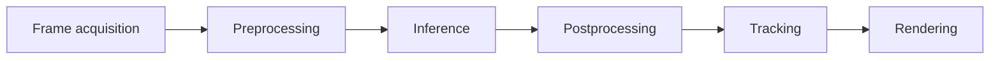

<Warning>
This page is a fully worked example of the format — every result below is a placeholder (`[ ]`). Run the experiment on your own hardware and dataset, then replace the placeholders with real numbers before publishing.
</Warning>

<CardGroup cols={3}>
  <Card title="Status">🟢 Completed</Card>
  <Card title="Category">Computer Vision · Object Detection</Card>
  <Card title="ID">EXP-CV-001</Card>
</CardGroup>

## Question

> Does increasing YOLO11 model size provide enough of an accuracy gain to justify the added latency and memory cost, in a real-time detection pipeline?

## Hypothesis

Bigger YOLO11 variants should detect more accurately, but I expect the latency cost to scale faster than the accuracy gain — to the point where the largest model isn't actually the right pick for a real-time system.

## Setup

### Hardware

| Component | Spec |
|---|---|
| GPU | [ your GPU, e.g. RTX 4060 ] |
| VRAM | [ ] GB |
| CPU | [ ] |
| RAM | [ ] GB |

### Software

| Component | Version |
|---|---|
| Python | 3.12 |
| PyTorch | [ ] |
| Ultralytics | [ ] |
| CUDA | [ ] |
| OS | [ ] |

### Dataset

| Field | Value |
|---|---|
| Images | [ ] |
| Classes | Person |
| Split | 70% train / 20% val / 10% test |

## Control variables

Only model size changes between runs. Everything else stays fixed:

| Held constant | |
|---|---|
| Dataset | ✅ Same |
| Image resolution | ✅ Same (640×640) |
| Epochs | ✅ Same |
| Batch size | ✅ Same |
| Hardware | ✅ Same |
| Confidence / IoU threshold | ✅ Same |
| Augmentation | ✅ Same |

**Variable under test:** model size — YOLO11n vs YOLO11s vs YOLO11m

## Metrics

- **Detection quality:** precision, recall, mAP@50, mAP@50:95
- **Performance:** FPS, end-to-end latency, latency per pipeline stage
- **Resources:** VRAM usage, GPU utilization

## Latency, broken down

"38 FPS" on its own doesn't tell you where the time is going. Every model in this experiment gets its latency split into pipeline stages so bottlenecks are visible instead of hidden inside one number.



| Stage | YOLO11n | YOLO11s | YOLO11m |
|---|---|---|---|
| Capture | [ ] ms | [ ] ms | [ ] ms |
| Preprocess | [ ] ms | [ ] ms | [ ] ms |
| Inference | [ ] ms | [ ] ms | [ ] ms |
| Postprocess | [ ] ms | [ ] ms | [ ] ms |
| Tracking | [ ] ms | [ ] ms | [ ] ms |
| Rendering | [ ] ms | [ ] ms | [ ] ms |
| **Total** | **[ ] ms** | **[ ] ms** | **[ ] ms** |

## Results

| Model | mAP@50 | FPS | Latency (median) | VRAM |
|---|---|---|---|---|
| YOLO11n | [ ]% | [ ] | [ ] ms | [ ] GB |
| YOLO11s | [ ]% | [ ] | [ ] ms | [ ] GB |
| YOLO11m | [ ]% | [ ] | [ ] ms | [ ] GB |

**Accuracy gain per step up:**
n → s: `[ ]` pts · s → m: `[ ]` pts

**FPS cost per step up:**
n → s: `[ ]`% · s → m: `[ ]`%

## Analysis

[Write what the numbers actually show once you have them. Was the hypothesis right? Where did the biggest latency jump happen — inference, or somewhere else in the pipeline that's easy to overlook? Did accuracy scale linearly with model size, or did it plateau?]

## Verdict

<Check>
[State the trade-off explicitly, e.g.: "For this workload, YOLO11s gives the best balance of detection quality and real-time throughput. YOLO11m's accuracy gain over YOLO11s doesn't offset its throughput cost for a real-time application."]
</Check>

<Info>
Engineering isn't about finding the best model — it's about finding the best model for the constraint you're actually working under.
</Info>

## Reproduce this

```yaml
repo: github.com/your-username/exp-cv-001
dataset: your-dataset-name v1.0
config: configs/exp-cv-001.yaml
environment: environment.yml
commit: <full sha>
hardware: RTX ____, ____ GB VRAM
```
